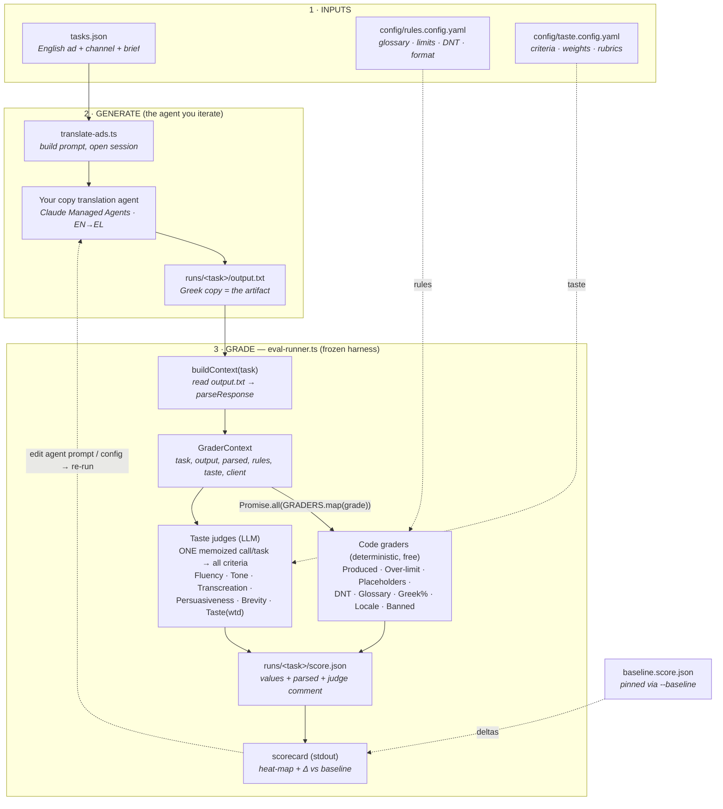

# Eval flow

How the ads-localization eval is wired. (Renders inline on GitHub. A static
`eval-flow.svg` sits alongside this file for non-Mermaid viewers.)

```mermaid
flowchart TB
  subgraph IN["1 · INPUTS"]
    T["tasks.json<br/><i>English ad + channel + brief</i>"]
    R["config/rules.config.yaml<br/><i>glossary · limits · DNT · format</i>"]
    Q["config/taste.config.yaml<br/><i>criteria · weights · rubrics</i>"]
  end

  subgraph GEN["2 · GENERATE (the agent you iterate)"]
    direction LR
    TR["translate-ads.ts<br/><i>build prompt, open session</i>"]
    AG["Your copy translation agent<br/><i>Claude Managed Agents · EN→EL</i>"]
    OUT["runs/&lt;task&gt;/output.txt<br/><i>Greek copy = the artifact</i>"]
    TR --> AG --> OUT
  end

  subgraph GRADE["3 · GRADE — eval-runner.ts (frozen harness)"]
    BC["buildContext(task)<br/><i>read output.txt → parseResponse</i>"]
    CTX["GraderContext<br/><i>task, output, parsed, rules, taste, client</i>"]
    CODE["Code graders (deterministic, free)<br/>Produced · Over-limit · Placeholders ·<br/>DNT · Glossary · Greek% · Locale · Banned"]
    JUDGE["Taste judges (LLM)<br/>ONE memoized call/task → all criteria<br/>Fluency · Tone · Transcreation ·<br/>Persuasiveness · Brevity · Taste(wtd)"]
    SCORE["runs/&lt;task&gt;/score.json<br/><i>values + parsed + judge comment</i>"]
    CARD["scorecard (stdout)<br/><i>heat-map + Δ vs baseline</i>"]
    BC --> CTX
    CTX -->|"Promise.all(GRADERS.map(grade))"| CODE
    CTX --> JUDGE
    CODE --> SCORE
    JUDGE --> SCORE
    SCORE --> CARD
  end

  BASE["baseline.score.json<br/><i>pinned via --baseline</i>"]

  T --> TR
  OUT --> BC
  R -.->|rules| CODE
  Q -.->|taste| JUDGE
  BASE -.->|deltas| CARD
  CARD -.->|"edit agent prompt / config → re-run"| AG
```
